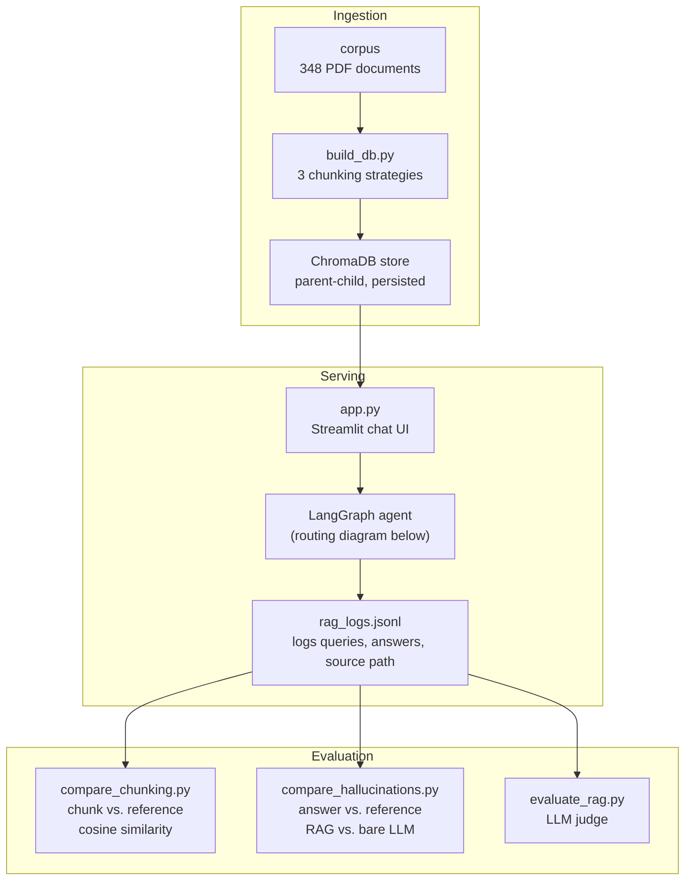
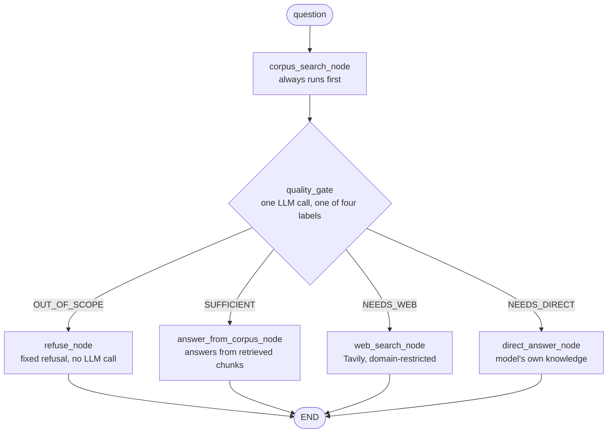

# ASD RAG

A retrieval and reasoning system for ASD (Autism Spectrum Disorder) clinical and caregiver literature. This project initially started as a RAG based implementation, with focus on evaluating chunking strategies and faithfulness, however this has now evolved into an agentic system: a LangGraph agent that always checks the curated corpus first, and for instances where the RAG response may be insufficient, falls back to a domain-restricted web search or the model's own knowledge depending on what the question needs. Built on LangChain, LangGraph, ChromaDB, and Groq-hosted LLMs, with a Streamlit UI that shows which path answered each question.




## 1. Purpose

Decisions around chunking strategy, embedding model, and prompt design shape how a RAG system behaves, but their effects are rarely verified. This project addresses that on two fronts:

* Retrieval-quality benchmarking: Three chunking strategies compared on retrieval quality and latency, and three separate evaluation methods (retrieval-level cosine similarity, generation-level grounding comparison, LLM-judged faithfulness) to pin down what "faithful to the source" actually means at different points in the pipeline.
* Agentic query routing: Instead of a single fixed pass, the system always retrieves from the corpus first, then uses an LLM as judge quality gate to decide which of the following scenarios is the most applicable: 
    * the retrieved context is enough
    * the question needs current information the corpus wouldn't have
    * the question needs some general knowledge beyond the context of the corpus
    * or whether the question lies outside ASD entirely and should be declined


## 2. How it works

**Ingestion:** `build_db.py` loads PDFs from the `corpus/` folder and builds a persisted ChromaDB vector store using one of the three supported chunking strategies, selected via the `--splitter` argument:
* **Standard** (`--splitter standard`): `RecursiveCharacterTextSplitter` with `chunk_size=1000`, `overlap=200`. Baseline for simple retrieval.
* **Parent-Child** (`--splitter parent-child`): Hierarchical splitting with small searchable chunks (`size=200`) retrieval but returns larger parent contexts (`size=1000`). Ensures a balance between search precision and context quality.
* **Semantic** (`--splitter semantic`): `SemanticChunker` that intelligently splits at meaningful boundaries using embedding similarity. Best coherence but slower processing.
* **Vectorization:** `HuggingFaceEmbeddings` using the `all-MiniLM-L6-v2` transformer (384-dimensional).
* **Storage:** Local persistence via **ChromaDB**.

**Retrieval, routing, and generation:** `app.py` serves a Streamlit chat UI backed by a LangGraph agent. Every question goes through the same graph:


Some design decisions behind this flow:
* The corpus search always runs first, rather than classifying scope before retrieving. This could possibly have caused a conflation between questions that are in scope but have a limited context in the corpus vs. clearly out of scope questions. Multiple tests have shown that this is infact not an issue for this system, but this still remains a point worth calling out.
* The `quality_gate` node just does one job - picks one of four labels: `OUT_OF_SCOPE`, `SUFFICIENT`, `NEEDS_WEB`, or `NEEDS_DIRECT`
* Domain Restricted `web_search_node`: Tavily is called directly with `include_domains` set to a curated list of government and major clinical/advocacy institutions to ensure response quality.
* Deterministic orchestration, non-deterministic decisions: The graph's structure i.e., which node runs next, how state moves along etc., is deterministic. `quality_gate`'s classification and each terminal node's answer are the model's own judgment, not something enforced in the code. Some nodes also carry their own scope-refusal instruction as a second, independent line of defense in case `quality_gate` misroutes.
* Terminal nodes generate, `quality_gate` only decides: `answer_from_corpus_node`, `web_search_node`, `direct_answer_node`, and `refuse_node` each produce their own final answer using a prompt tailored to their own context source. `quality_gate` never writes user-facing text - keeps the decision and the answer separate, keeps the trace readable.


**Evaluation:** Three evaluation methods are implemented to test different features of the pipeline.

| Method | Script | Summary |
|---|---|---|
| Chunk-retrieval similarity | `compare_chunking.py` | Cosine similarity between a hand-written reference answer and the *retrieved chunks*. Used for evaluating the best chunking strategy for this application. |
| Grounding comparison | `compare_hallucinations.py` | Cosine similarity between the *generated answer* and a reference, comparing the full RAG pipeline against a bare LLM with no retrieval |
| LLM-judged faithfulness | `evaluate_rag.py` | DeepEval's `FaithfulnessMetric`, using a separate LLM (`llama-3.3-70b-versatile`) as judge to check whether each claim in a generated answer is supported by, contradicted by, or unverifiable from the retrieved context |

The LLM judged faithfulness is the most rigorous test here. It decomposes the response into individual claims, checking each one against the source material. This is also why a stronger model is used as a judge here compared to the faster model for production answering.


## 3. Current Capabilities
 
* Three chunking strategies (standard, parent-child, semantic), independently benchmarked.
* Persisted ChromaDB vector stores per strategy, built via a CLI (`build_db.py --splitter <strategy>`).
* Agentic query routing via a LangGraph StateGraph: corpus-first retrieval, LLM-judged four-way routing, domain-restricted web search fallback, general-knowledge fallback, and scoped refusal.
* Streamlit chat UI with source information.
* Three independent evaluation methods, each targeting a different part of the pipeline.
* LLM-as-judge faithfulness evaluation with structured JSON logging and console summary stats (pass rate, verdict distribution).
* Consistent logging (`logger_config.py`) across all scripts.


## 4. Project Structure
 
```
rag_asd/
├── app.py                              # Streamlit chat UI
├── src/
│   ├── logger_config.py                # common logging setup
│   ├── constants.py                    # shared config: LLM model/temp, curated web domains  
│   ├── agent/
│   │   ├── state.py                    # AgentState - shared state passed between graph nodes
│   │   ├── nodes.py                    # all six node functions
│   │   ├── graph.py                    # StateGraph construction and compilation
│   │   ├── retriever.py                # shared ParentDocumentRetriever builder
│   │   ├── llm.py                      # shared ChatGroq instance
│   │   └── web_search.py               # shared Tavily client  
│   ├── ingestion/
│   │   └── build_db.py                 # corpus loading + chunking + vector store build
│   └── evaluation/
│       ├── compare_chunking.py         # chunking strategy benchmark
│       ├── compare_hallucinations.py   # RAG vs. bare LLM grounding comparison
│       └── evaluate_rag.py             # LLM-as-judge faithfulness evaluation (DeepEval)
├── corpus/                             # input PDFs
├── vector_db_parent-child/             # persisted vector store
├── parent_store/                       # persisted parent documents for ParentDocumentRetriever
├── data/
│   └── rag_logs.jsonl                  # logged queries and answers, feeds evaluate_rag.py
├── logs/                               # script logs + evaluate_rag.py JSON output
├── .streamlit/
│   └── secrets.toml.example            # sample template for .streamlit/secrets.toml
├── requirements.txt
└── README.md
```

## 5. Setup and Usage
 
```bash
pip install -r requirements.txt
```
 
Add a `.env` file with 

```bash
GROQ_API_KEY=your_groq_key_here
TAVILY_API_KEY=your_tavily_key_here
```

**Build the vector store.** 

Place your PDFs in the `corpus/` directory and choose a chunking strategy. Currently, the app depends on the parent-child store specifically:
 
```bash
python -m src.ingestion.build_db --splitter parent-child
```
Alternate Options:

```bash
# Standard (fastest, recommended for baseline)
python -m src.ingestion.build_db --splitter standard

# Semantic (slower)
python -m src.ingestion.build_db --splitter semantic
```

**Launch the app:**
 
```bash
streamlit run app.py
```
 
**Reproduce the chunking benchmark** (builds and compares all three strategies from scratch):
 
```bash
python -m src.evaluation.compare_chunking
```
 
**Compare RAG vs. bare-LLM grounding** on in-scope and out-of-scope questions:
 
```bash
python -m src.evaluation.compare_hallucinations
```
 
**Run LLM-judged faithfulness evaluation** against logged queries (requires having used the app first, so `data/rag_logs.jsonl` has entries):
 
```bash
python -m src.evaluation.evaluate_rag
```

## 6. Results
 
### Chunking strategy comparison
 
Benchmarked on the ASD corpus (348 documents) across 3 domain-specific queries:
 
| Strategy | Chunks | Avg size | Chunking time | Retrieval latency | Faithfulness (max / mean) |
|---|---:|---:|---:|---:|---:|
| Standard | 735 | 749 chars | 0.05s | 31.9ms | 0.717 / 0.650 |
| Parent-child | 3102 | 156 chars | 0.11s | 23.4ms | **0.746 / 0.690** |
| Semantic | 713 | 680 chars | 94.4s | 37.6ms | 0.697 / 0.600 |
 
Parent-child chunking comes across better on both faithfulness measures and has the lowest retrieval latency, at the cost of a larger index (3,102 vs. 735 chunks). Semantic chunking's expected coherence advantage didn't translate into better retrieval on this corpus, and its chunking time is significantly slower than the alternatives. This is the basis for `app.py` using parent-child chunking in production.
 
### LLM-judged faithfulness
 
Evaluated 6 logged queries with `FaithfulnessMetric` (DeepEval), judged by `llama-3.3-70b-versatile`:
 
```
Pass rate: 100% (6/6 passed threshold 0.7)
Perfect scores (1.0): 6/6
Mean claims per case: 7.2
Verdicts across all cases: 42% yes, 58% idk, 0% no
```
 
**Key Findings**
* Zero claims were flagged as contradicting the retrieved context - across every logged query, the system never asserted something the source material disputed. 
* Only 42% of individual claims were assigned a clean "yes" (directly traceable to specific retrieved text); the remaining 58% were "idk" - not contradicted, but not strictly confirmable either, possibly because the model synthesized or lightly elaborated on what was retrieved rather than quoting it directly.

### Hallucination Comparison: RAG vs LLM

Tested across 4 in-scope and 3 out-of-scope questions. The RAG scored higher on grounding in 3 of 4 in-scope questions. More critically, it correctly refused all 3 out-of-scope questions while the LLM answered two as fact. In a clinical context, refusing to answer outside the corpus is safer than confabulating from general knowledge.

## 7. Environment Configuration

Create or update `.env` file with your API keys:

```bash
# Required for Groq LLM inference
GROQ_API_KEY=your_groq_key_here

# Required for the agent's web search fallback
TAVILY_API_KEY=your_tavily_key_here

# Optional: For LLM-based faithfulness evaluation
OPENAI_API_KEY=your_openai_key_here

# Optional: For HuggingFace Hub LLM models
HUGGINGFACEHUB_API_TOKEN=your_huggingface_token_here
```

Keys are automatically loaded via `python-dotenv` when scripts run.

---

## 8. Known Limitations
 
* **Smaller Evaluation sets:** All benchmark tests use a small set of queries - Currently these are directionally indicative rather than statistically robust.
* **Cosine-similarity-based faithfulness** (chunking and hallucination comparisons) is a proxy, not a direct faithfulness check.
* **The Chroma import used throughout (`langchain_community.vectorstores.Chroma`)** is deprecated in favor of the `langchain_chroma` package. A migration is planned.


## 9. Roadmap
 
* Migrate to `langchain_chroma.Chroma`.
* Expand evaluation sets for more statistically meaningful benchmark numbers.

## License
MIT